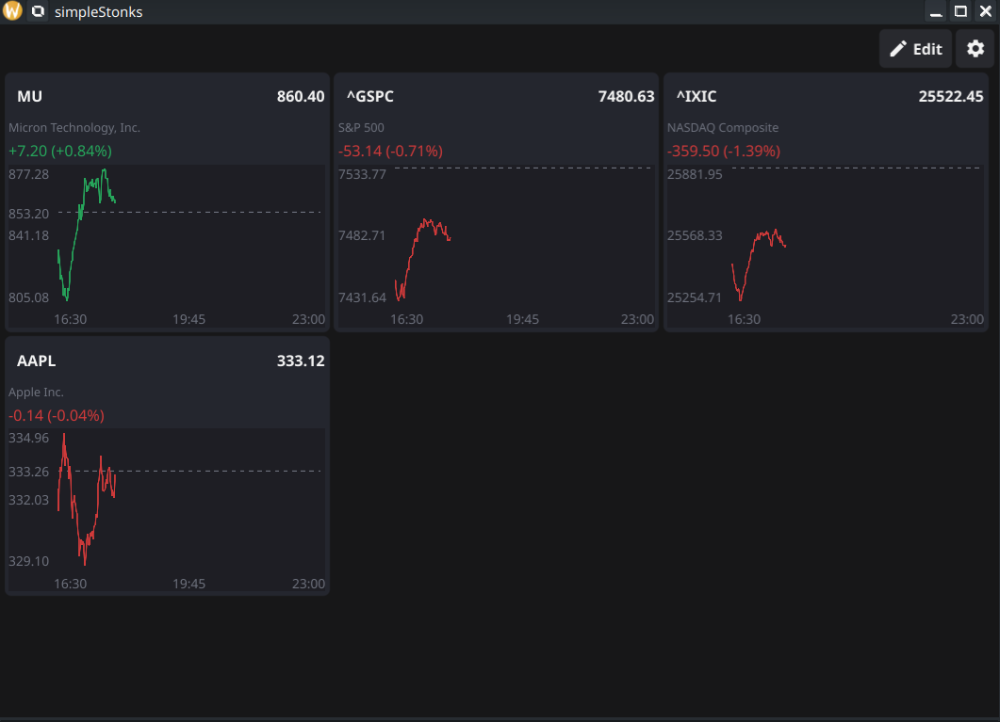
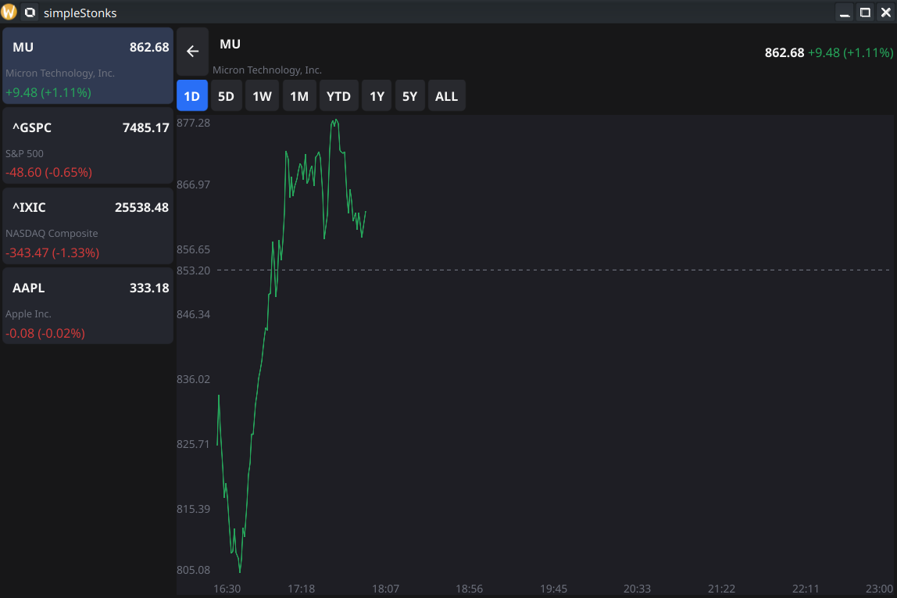
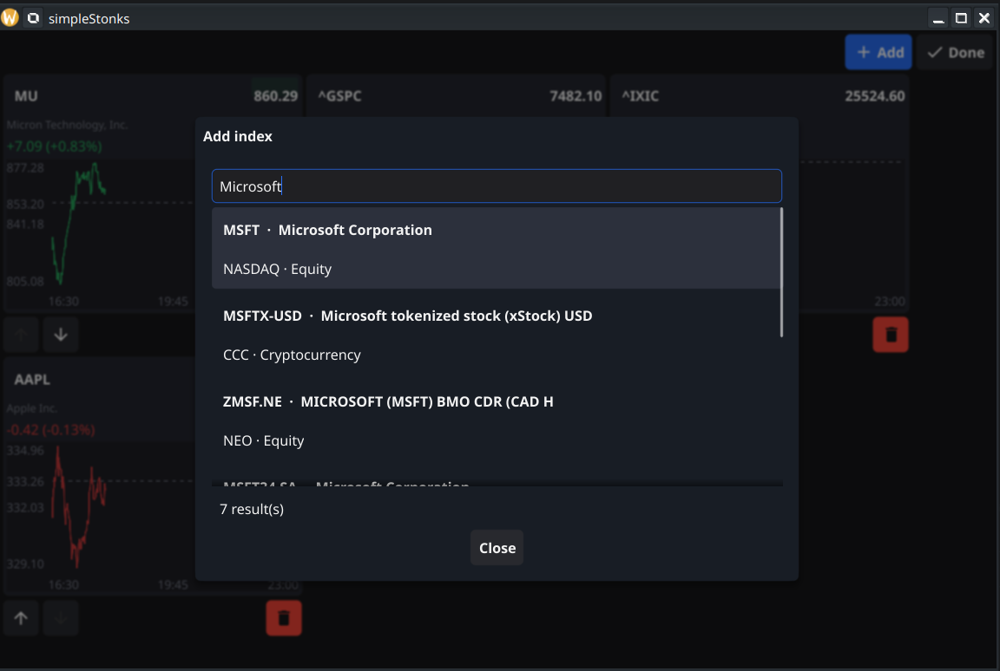
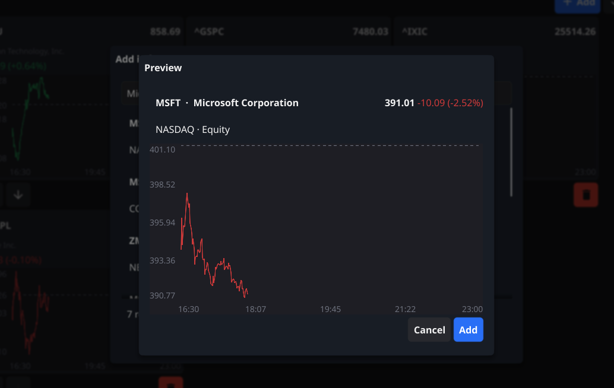

# simpleStonks

A bare-bones, Yahoo-Finance-style stock tracker for the Linux desktop.
simpleStonks shows a configurable list of stock indexes and tickers, charts
their movement live, and stays out of your way.

> **Full disclosure:** this is a vibe-coded app I built when I was bored.
> It scratched the itch. It may scratch yours too — but set your expectations
> accordingly.

## Screenshots

**Home grid** — your tracked symbols at a glance: live price, day change, and a
1D mini chart with price/time axes and a dashed previous-close reference line.



**Detail view** — an expanded chart with 1D/5D/1W/1M/YTD/1Y/5Y/ALL range
toggles and a sidebar of all tracked symbols. The 1D chart spans the full
trading session and fills in gradually while the market is open.



**Edit mode & search** — reorder or remove tiles, and add new ones through a
live symbol search…



…with a chart preview before you commit to adding anything.



## Features

- Track any symbols Yahoo Finance knows about — indexes, stocks, ETFs, crypto
- Live-updating prices; a changed price flashes green/red as it ticks
- Charts with price/time axes, a previous-close reference line, and
  Yahoo-style gradually-filling intraday view
- Range toggles from 1D to ALL in the detail view
- Manage the tracked list entirely from the UI: live search with preview,
  reorder, remove
- Settings window for refresh interval, default range, and logging
- Config lives in a plain JSON file with **live two-way reload** — edit it in
  the app or in your editor, no restart needed

## Install

Snap Store release is planned but not published yet. Until then, build from
source (below).

## Build and run from source

Requires Go 1.23+ and (for the GUI) some system dev headers.

```sh
# 1. Install system build deps (Debian/Ubuntu)
sudo apt install pkg-config gcc libgl1-mesa-dev xorg-dev libwayland-dev libxkbcommon-dev

# 2. Clone
git clone git@github.com:MarioStoilov/simpleStonks.git
cd simpleStonks

# 3. Build and run
go mod download
go run ./cmd/simplestonks
```

See [docs/DEVELOPMENT.md](docs/DEVELOPMENT.md) for the full prerequisites, the
`make` targets, test commands, runtime file locations, and development notes.

## Tech

- Go + [Fyne](https://fyne.io/) for the UI
- Market data from Yahoo Finance's public chart/search endpoints (no API key)
- Config follows the XDG spec (`~/.config/simplestonks/config.json`)
- Packaged with snapcraft for the Snap Store

## Disclaimer

Prices come from unofficial, keyless Yahoo Finance endpoints and can lag,
break, or disappear at Yahoo's whim. Nothing here is financial advice —
it's a widget written by a bored person.

## License

_To be decided._
